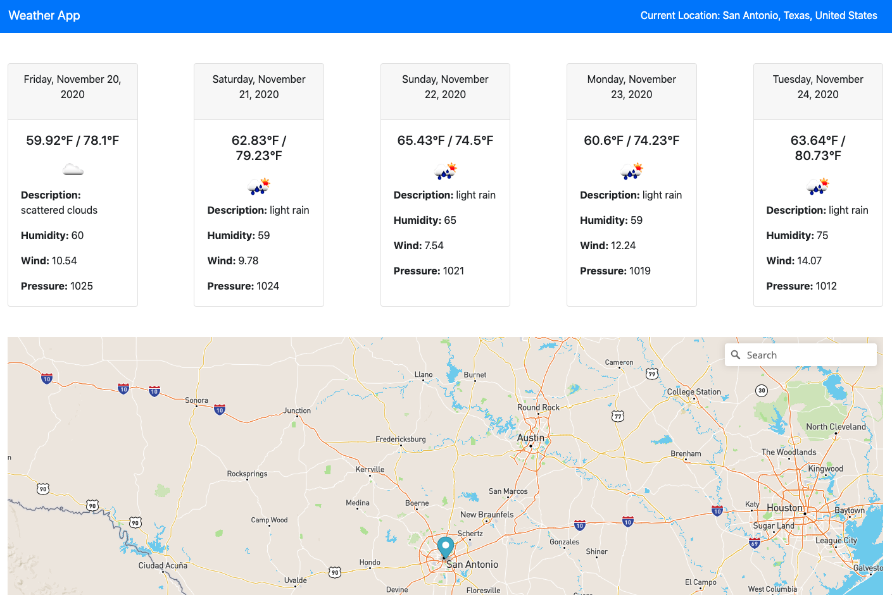

# Weather Map Project

View this project live [here](https://elegant-carson-be38ac.netlify.app/)

This is a repository for a solution to the updated weather map project. This project utilizes Bootstrap, Mapbox API, and the Open Weather Map API.

On initial page load, a 5 day forecast is displayed for San Antonio, TX. You are able to drag the marker or use the geocoder search box to display an updated weather forecast. View additional branches to see different stages of this project.

### Getting Started Locally
1. Create a Mapbox account
2. Create an Open Weather Map Account
3. Create a `keys.js` file in the js directory
4. Copy the setup from `sample-keys.js` to your `keys.js`
5. Add your API keys to the `keys.js` 

